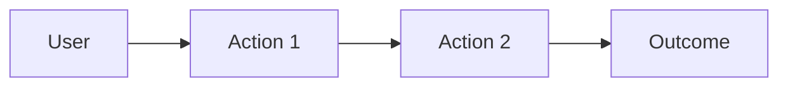

# Project: Problem, Solution & Impact

One place for the **what** and **why** of your project. Replace the headings below with your content.

**Tip:** Use [Mermaid](https://mermaid.js.org/) diagrams in this doc to illustrate user journeys, value flows, or problem→solution flow. GitHub and most docs render Mermaid in fenced code blocks with ` ```mermaid `.

---

## 1. Problem

- What specific problem are you solving?
- Who is affected (users, ecosystem, developers)?
- Why does it matter? (Impact, evidence, or context.)

---

## 2. Solution

- High-level approach: how does your solution address the problem?
- Key features or capabilities.
- Why this approach works and how it differs from alternatives.

**Optional — user journey (Mermaid):** A diagram helps judges see the flow at a glance. Example:



Replace with your own steps (e.g. Connect wallet → Deposit → Earn → Withdraw). You can use `flowchart`, `journey`, or `sequenceDiagram` depending on what you want to show.

---

## 3. Business & Ecosystem Impact

- Target users and adoption path.
- Value to the ecosystem (chain, developers, users).
- Monetization or sustainability (if applicable).

---

## 4. Limitations & Future Work

- Current limitations and known risks or assumptions.
- Short-term and longer-term roadmap.
- Open questions or next validations.
