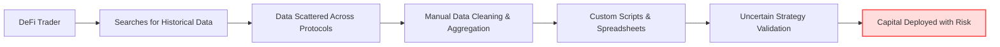
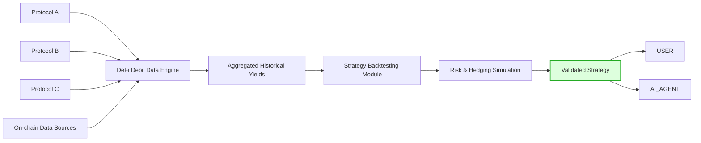

# DeFi Debil

## Backtesting Infrastructure for DeFi Strategies

---

## 1. Problem

DeFi traders face a fundamental challenge:  
**Backtesting is complex, fragmented, and inaccessible.**

- Historical data across protocols is difficult to obtain  
- Evaluating position profitability requires significant manual effort  
- Designing effective hedging strategies is technically demanding  

As a result, every trader builds their own tooling from scratch.  
This duplication of effort slows innovation and limits ecosystem growth.

Traders operate in uncertainty — deploying capital without reliable validation of their strategies.

---

## 2. Solution

**DeFi Debil** aggregates historical yield and performance data across DeFi protocols and makes it actionable.

Our platform enables traders to:

- Access structured historical returns data  
- Combine datasets across multiple protocols  
- Build and backtest fully custom strategies  
- Evaluate risk, profitability, and hedging scenarios before going live

---

## Our Vision

DeFi Debil transforms fragmented on-chain data into a unified backtesting engine —  
bringing clarity, confidence, and scalable strategy development to DeFi.

---

## 3. Business & Ecosystem Impact

### Expanding Access to DeFi

**DeFi Debil simplifies entry into DeFi** by giving users powerful yet accessible tools to operate with confidence.

The platform enables users to:

- Share and discover strategies within the community  
- Run comprehensive, multi-protocol backtests  
- Simulate complex risk and hedging scenarios 
- Allocate and manage capital intelligently and efficiently
- Access the platform programmatically via AI agents using x402

By lowering technical barriers and increasing transparency, DeFi Debil empowers users to participate in DeFi with institutional-grade decision-making tools — without institutional complexity.

---

## 4. Limitations

At the current stage, DeFi Debil supports a limited set of integrations.

Currently supported:

- 3 protocols on the BNB Chain:
  - Venus (lending)
  - PancakeSwap v3 (concentrated liquidity / CLMM)
  - Aster (perpetuals)

Protocol and chain coverage will expand as the platform evolves.

---

## 5. Future Work

We are continuously expanding the capabilities of DeFi Debil to make strategy research and execution more robust and intelligent.

Planned improvements include:

- Enhanced concentrated liquidity engine for more accurate AMM simulations  
- Accounting for potential liquidations in lending-based strategies  
- Advanced rebalancing conditions for individual strategy components  
- Shareable strategy links for seamless collaboration and distribution
- Support for a broader range of DeFi protocols   
- AI-powered generation of strategy descriptions from natural language prompts  
- Expanded dashboard analytics with deeper performance and risk insights  

Our goal is to evolve DeFi Debil into a fully autonomous, research-grade DeFi strategy lab.

