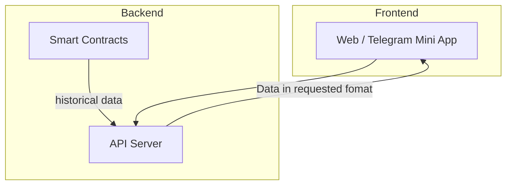
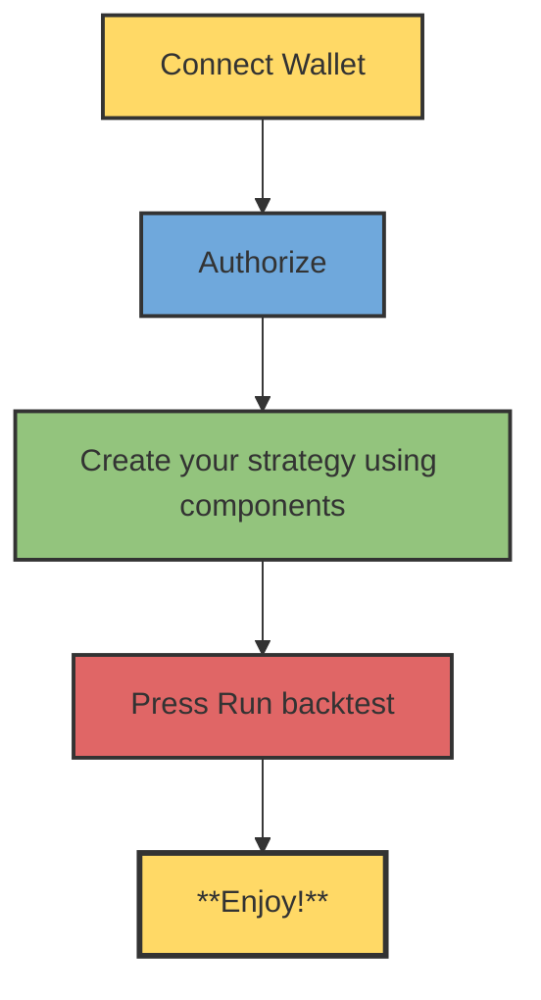

# Technical: Architecture, Setup & Demo

---

## 1. Architecture

- **System overview** — High-level description of the full system.
- **Components** — Frontend, backend, smart contracts (or equivalent); how they connect.
### Data Collection

**Current State:**  
Data from the blockchain has been collected manually for the past 2 years (since Jan 1, 2024).

**Future Vision:**  
Automated, real-time data fetching will continuousl

---

## 2. Setup & Run

- **Prerequisites** — Required tools, versions, accounts (e.g. Node 18+, MetaMask, testnet faucet).
- **Environment** — Env vars, API keys, endpoints (use `.env.example` if needed).
- **Install & build** — Commands to install dependencies and build.
- **Run** — How to start each part (e.g. backend, contracts, frontend) and in what order.
- **Verify** — How to confirm it works (e.g. tests, open URL, run a script).

---

## 3. Demo Guide

- **Access** — https://debil.capital/
- **User flow:**

---

## 4. Deep dive

This section is a **minimal technical navigator**: where to look in the code to quickly verify the math and integrations.

- **x402 / metered access to backtests**  
  - x402 configuration and payment checks for all `/backtest/*` endpoints: `backend/api.py` (26–77, 342–405, 406–672).

- **Lending (Venus Core Pool)**  
  - Rate math, position compounding, and health factor: `backend/lending_backtest.py` (30–36, 73–88, 127–171, 185–351).  
  - Public health-metric endpoint: `/lending/position-health` in `backend/api.py` (323–335).

- **CLMM (PancakeSwap)**  
  - Concentrated liquidity simulation on historical price/volume/liquidity: `backend/clmm_backtest.py` (30–35, 68–101, 103–419).  
  - API wrapper and ROI/APY calculation: `/backtest/clmm` in `backend/api.py` (558–607).

- **Perps (linear futures)**  
  - PnL, equity, and liquidation logic for BNB/USDT perps: `backend/perp_backtest.py` (1–16, 27–33, 49–147).  
  - API wrapper and final PnL/ROI/APY summary: `/backtest/perp` in `backend/api.py` (495–555).

- **LLM prompts & skills (upcoming)**  
  - System prompts and LLM wiring: `lllm.txt` (will be added to the repo root).  
  - AI skills and agent capabilities: `SKILLS.md` (will document how external agents can safely drive the backtesting engine).