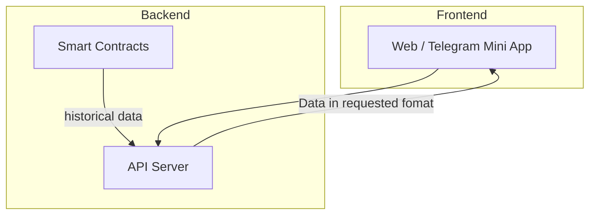
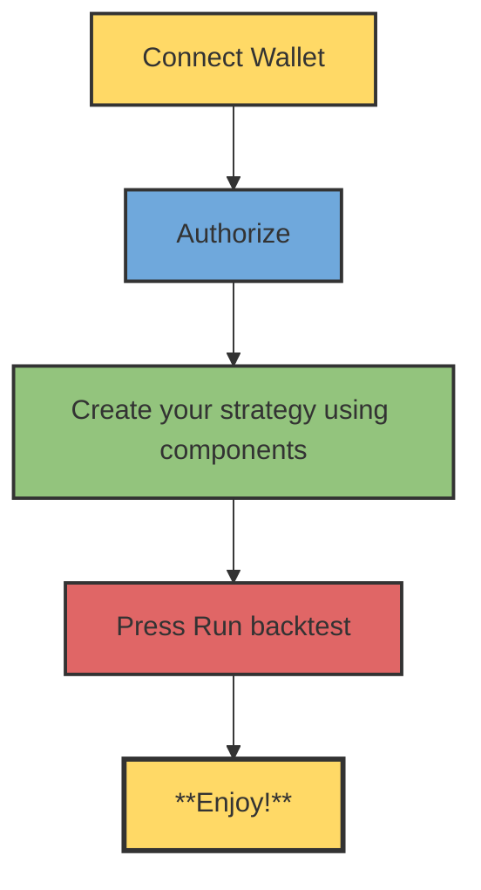

# Technical: Architecture, Setup & Demo

---

## 1. Architecture

- **System overview** — High-level description of the full system.
- **Components** — Frontend, backend, smart contracts (or equivalent); how they connect.
### Data Collection

**Current State:**  
Data from the blockchain has been collected manually for the past 2 years (since Jan 1, 2024).

**Future Vision:**  
Automated, real-time data fetching will continuousl



---

## 2. Setup & Run

### Prerequisites
- **Node.js 18+**
- **Python 3.13+**
- **Docker & Docker Compose** (optional, for containerized deployment)
- **MongoDB** (local instance or remote connection string)

### Environment Configuration
1. Copy `.env.example` to `.env` in the project root:
   ```bash
   cp .env.example .env
   ```
2. Configure the following parameters in `.env`:
   - `ACME_EMAIL`: Email address for Let's Encrypt SSL certificate generation (Traefik).
   - `MONGO_INITDB_ROOT_USERNAME`: Root username for MongoDB initialization.
   - `MONGO_INITDB_ROOT_PASSWORD`: Root password for MongoDB.
   - `DB_NAME`: Name of the database to use (e.g., `defi_debil`).
   - `JWT_SECRET`: Secret key used for signing authentication JWTs.

### Data Preparation
The backtesting engine requires historical data files. Ensure the following files are placed in the `data/` directory:
- `data/perps/bnb-klines.csv`: Historical BNB price data (K-lines).
- `data/clmm/processed_liquidity.pkl`: Processed liquidity snapshots for CLMM.
- `data/lending/bnb_history.csv`: Utilization data for BNB on Venus lending.
- `data/lending/usdc_history.csv`: Utilization data for BNB on Venus lending.

### Option 1: Local Development (Manual)

#### Backend (API)
1. Navigate to the `backend` directory:
   ```bash
   cd backend
   ```
2. Install Python dependencies:
   ```bash
   pip install -r requirements.txt
   ```
3. Start the API server with auto-reload:
   ```bash
   uvicorn api:app --reload
   ```
   The backend will be available at `http://localhost:8000`.

#### Frontend (App)
1. Navigate to the `frontend/app` directory:
   ```bash
   cd frontend/app
   ```
2. Install Node dependencies:
   ```bash
   npm install
   ```
3. Start the development server:
   ```bash
   npm start
   ```
   The application will be available at `http://localhost:3000`.

### Option 2: Docker Compose
To run the full stack (Traefik, MongoDB, Backend, Frontend, Landing) in containers:

1. Build and start the services:
   ```bash
   docker-compose up --build -d
   ```
2. Verify the services are running:
   - **Landing Page**: `http://your_domain` (or configured domain)
   - **App**: `http://app.your_domain` (via Traefik routing)
   - **API**: `http://api.your_domain` (via Traefik routing)
<b>You will need to have a spare domain name to setup Trefik from docker compose<b>

---

## 3. Demo Guide

- **Access** — https://debil.capital/
- **User flow:**



---

## 4. Deep dive

This section is a **minimal technical navigator**: where to look in the code to quickly verify the math and integrations.

- **x402 / metered access to backtests**  
  - x402 configuration and payment checks for all `/backtest/*` endpoints: `backend/api.py` (26–77, 342–405, 406–672).

- **Lending (Venus Core Pool)**  
  - Rate math, position compounding, and health factor: `backend/lending_backtest.py` (30–36, 73–88, 127–171, 185–351).  
  - Public health-metric endpoint: `/lending/position-health` in `backend/api.py` (323–335).

- **CLMM (PancakeSwap)**  
  - Concentrated liquidity simulation on historical price/volume/liquidity: `backend/clmm_backtest.py` (30–35, 68–101, 103–419).  
  - API wrapper and ROI/APY calculation: `/backtest/clmm` in `backend/api.py` (558–607).

- **Perps (linear futures)**  
  - PnL, equity, and liquidation logic for BNB/USDT perps: `backend/perp_backtest.py` (1–16, 27–33, 49–147).  
  - API wrapper and final PnL/ROI/APY summary: `/backtest/perp` in `backend/api.py` (495–555).

- **Batch Requests**
  - Endpoint: `/backtest/batch`
  - Implementation: `backend/api.py` (see `run_batch_backtest`).
  - Allows combining multiple strategies (Lending, Perp, CLMM) into a single execution request. It returns an aggregated summary of all sub-strategies.

- **LLM & AI Agent Integration**
  - **`llms.txt`**: Standardized project context for LLMs.
    - URL: `https://debil.capital/llms.txt`
  - **`SKILL.md`**: Machine-readable skill definition for AI agents (e.g., OpenClaw).
    - URL: `https://debil.capital/skills/defi-debil-backtest/SKILL.md`
  - **Discovery**: Links to these files are embedded in the Landing Page HTML `<head>` for automatic discovery by AI agents:
    ```html
    <link rel="llms-txt" href="/llms.txt" />
    <link rel="skill" href="/skills/defi-debil-backtest/SKILL.md" />
    ```